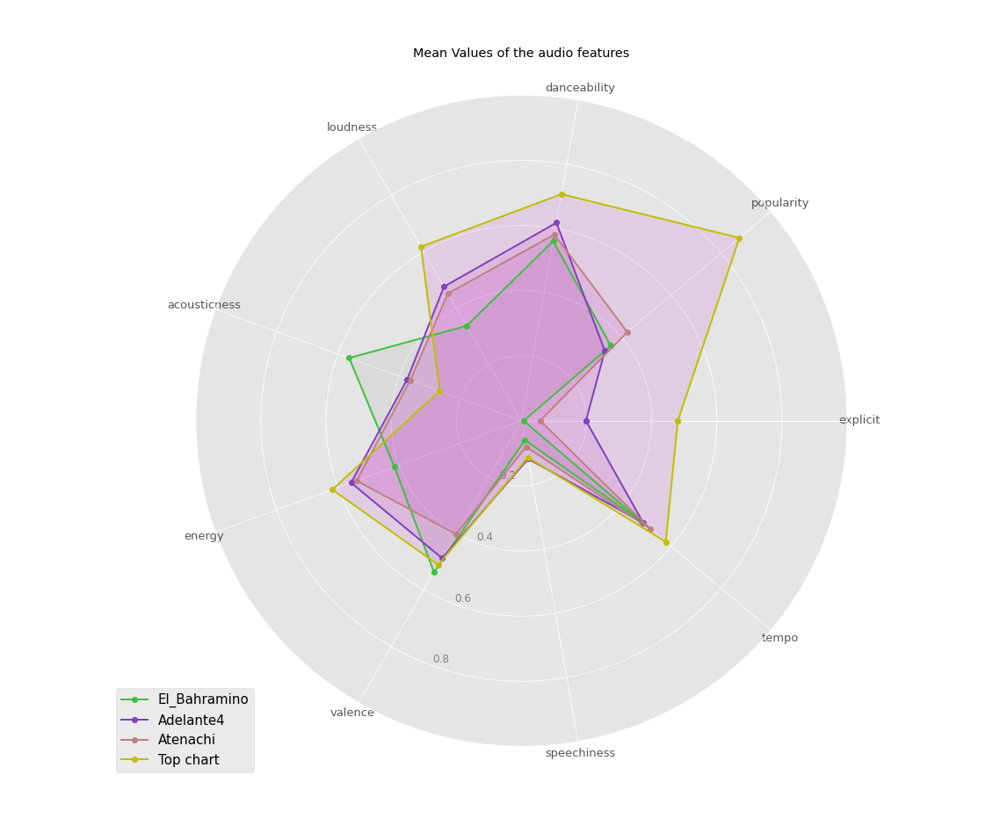
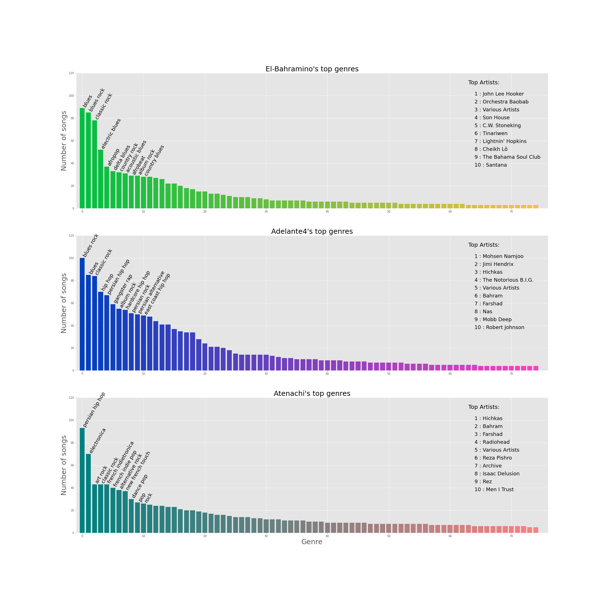
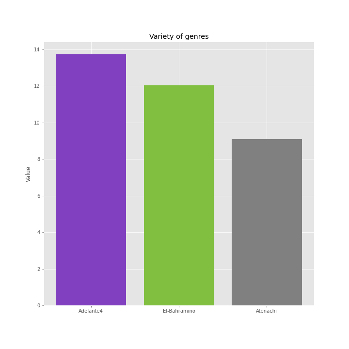
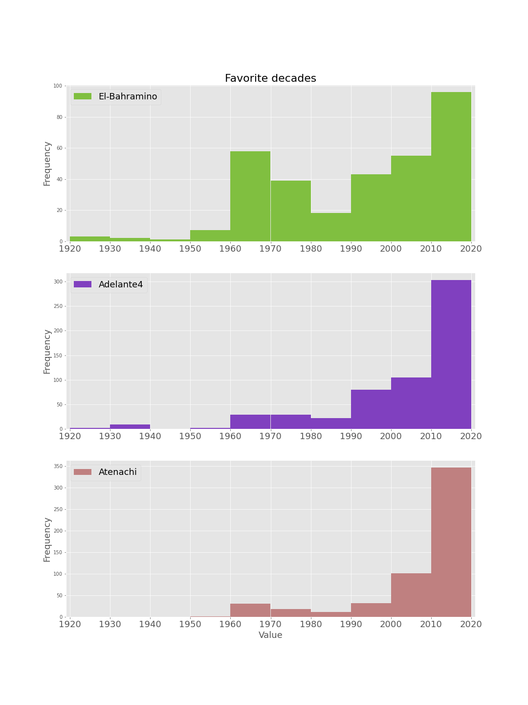
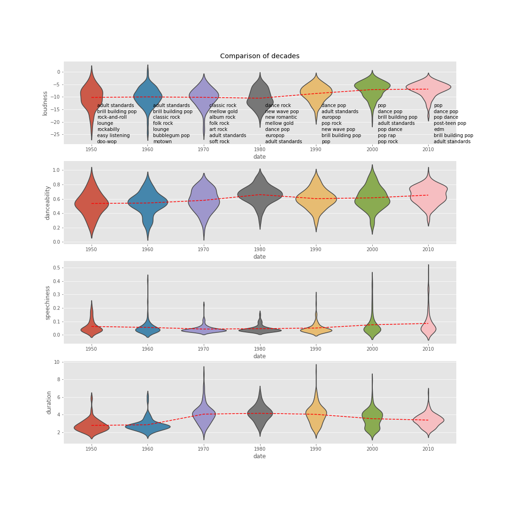

# spotify_analysis

In this project, I use Spotify's API to do some analysis. My work is listed below:

1. Data gatheration
2. Descriptive analysis and visualization
3. Building and comparing different song recommender systems
4. Experimenting on how to embed Genre Info

## Some comparisons among the music taste of me, my friends and the world:

## What has exactly changed in music through time? 

